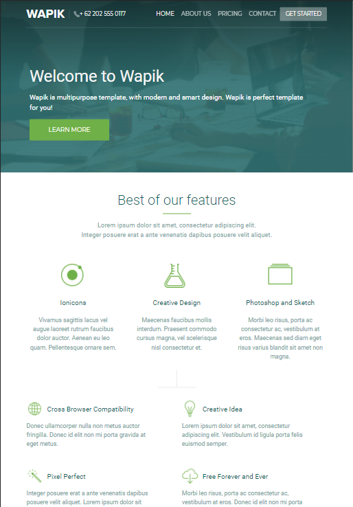

This project is made using free template, bootstrap, gulp and enthusiasm. Made this while learning to work with gulp.

There is four pages, and the feature is that headers are different for each. I tried to create an adaptive and responsive interface, and I done :)

Here you can see how the page looks on the tablet:

on smartphone:

